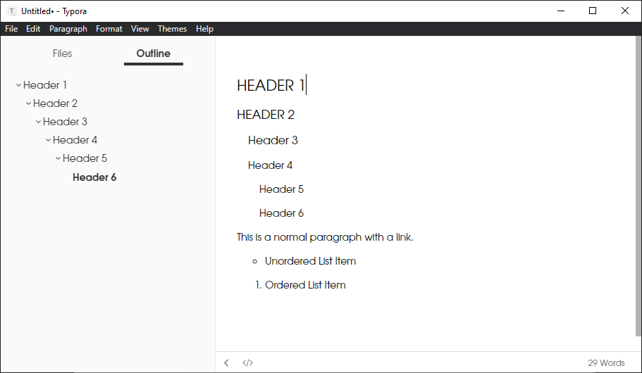
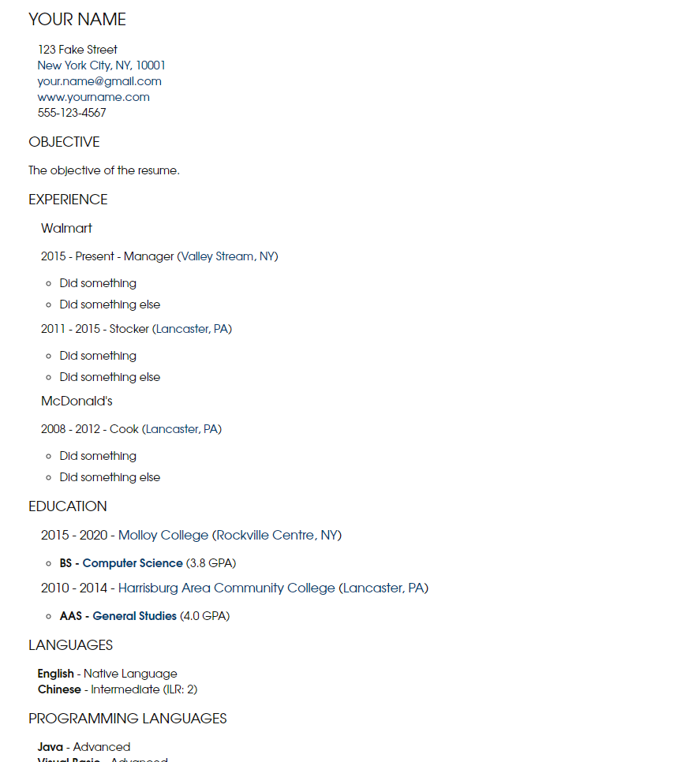

# Resume

A Typora theme designed to create resumes using Markdown. This theme is also well-suited for outlines. The basic components of the theme appear like this:

An example of how a resume looks:

To install the theme in Typora see [here](https://theme.typora.io/doc/Install-Theme/).